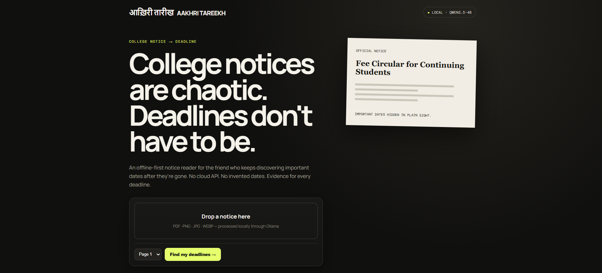

# Aakhri Tareekh — आख़िरी तारीख



**An offline-first college notice reader built for a friend who keeps missing deadlines.**

Aakhri Tareekh uses the open-weight **Qwen3.5-4B** model through **Ollama** to read PDF/image notices locally and extract deadlines, affected students, actions, fees and evidence. It deliberately returns `unclear` instead of guessing when a date is ambiguous.

## Why open-source AI matters
- **Privacy:** notices stay on the laptop; no cloud AI API is required.
- **Offline:** once the model is downloaded, analysis can run without internet.
- **Custom behavior:** the extraction prompt is designed around college notices and a strict no-guessing policy.
- **No per-notice API bill:** inference is local.
- **Model freedom:** the app talks to Ollama, so the model can be swapped later.

## Run locally

Requirements: Python 3.10+, Ollama, and `qwen3.5:4b`.

```powershell
ollama run qwen3.5:4b
```
Keep Ollama available, then in another PowerShell:

```powershell
cd path\to\aakhri-tareekh
python -m pip install -r requirements.txt
python -m uvicorn app.main:app --reload --port 8000
```
Open `http://localhost:8000`.

## Demo flow
1. Upload a college notice PDF or image.
2. Choose the page containing the dates.
3. Qwen3.5-4B reads it locally.
4. The UI shows the extracted deadline, action, audience, fee and evidence.
5. Confirmed dates can be exported as an `.ics` calendar event.

## Challenge
Built for the Hacktoberfest Weekend Challenge: **Build for a Friend**.

Tags: `#devchallenge` `#weekendchallenge` `#hf26challenge`
